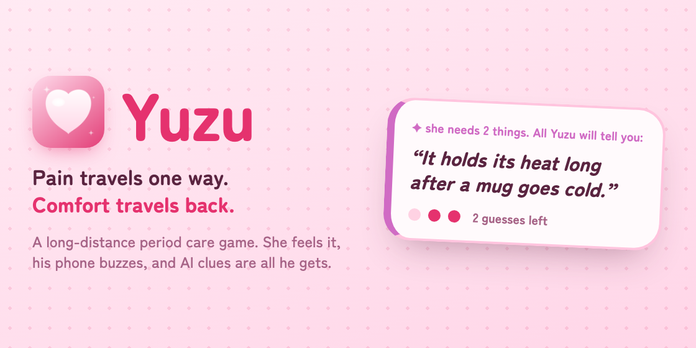

# 🍊 Yuzu

**Pain travels one way. Comfort travels back.**



A game for couples who are apart. She writes how her period pain feels. His phone
starts buzzing and keeps buzzing. He never sees what she wrote, only short clues
from the AI, and he has to work out what she needs from a drawer of things he can
send. Only she can make it stop.

| | |
|---|---|
| **Live app** | https://yuzu-vert.vercel.app |
| **Try it with no sign-in** | https://yuzu-vert.vercel.app/demo |

Built for the Elevate Women Global Hackathon.

---

## How a round works

1. **She writes how she feels**, in her own words, and sets how bad it is from 1 to 10.
2. **His phone buzzes.** The rhythm follows her pain: sharp pain is short hard pulses,
   a heavy ache is a slow grind.
3. **He sees clues, never her words.** He picks something from his drawer: a hot water
   bottle, tea, a blanket, painkillers, a hug, food, cancelling her morning, or
   favourites he adds himself.
4. **She judges every gift**: *That helped* or *Not really*. His phone only stops when
   everything she needs is met.
5. **He gets three wrong guesses.** After the third, her real message appears on his
   screen, his drawer locks, and she hits back. Every 👊 🔨 🥊 ⚡ lands on his screen
   with a sound and a buzz.

Her screen is a small anime room. Every gift he sends appears around her, and the room
warms up as her pain score falls to zero.

---

## What the AI does

One Gemini call. Her sentence goes in, three things come out:

| Output | Why it needs AI |
|---|---|
| **A vibration pattern** | "Stabbing" and "dull ache" should feel different. Fixed buttons cannot do that. |
| **Every need she mentioned** | "I'm freezing, my back is killing me and I miss you" is **three** needs. His phone keeps going until all three are met. |
| **Three clues per need** | One for each guess he has. They make him think, rather than handing him the answer. |

**Counting needs.** The model first lists her separate complaints, then writes exactly
one need per complaint. That stops it inventing a need she never asked for, or
dropping one she did.

**The three clues:**

1. **Shows the problem without naming it.** Not "she is hungry" but *"her stomach has
   started making the decisions."*
2. **Rules out one thing in his drawer**, so he stops considering it.
3. **Describes the right thing without its name.** Not "send a hot water bottle" but
   *"it holds its heat long after a mug goes cold."*

**Checked in code, not just asked for.** The rules are a system prompt, and her message
is sent separately, so what she writes cannot change how the rules work. Every clue is
then checked before he sees it. A clue that reads like an instruction, names the item
he is looking at, or rules out something she actually needs is replaced.

**Always works.** Gemini runs only on the server, so the key never reaches a browser
and her words never reach his phone early. Replies take about 1.3 seconds. If Gemini
is down or has no key, built-in rules answer instead.

Code: `lib/translate.ts` (prompt, checks, fallback) and `app/api/translate/route.ts`.

---

## Features

- **Google sign-in** that stays signed in. Sign out is on the rooms screen.
- **Several rooms at once.** She can give a different Cuddle Code to different people,
  switch between rooms, and close one for good. Her pain only reaches the room she is in.
- **Share the code in one tap.** On a phone it opens the share sheet, so the code goes
  straight into WhatsApp.
- **His drawer is his.** He can reorder it by dragging, throw things out, put them back,
  and add her favourites with any emoji.
- **Notifications when his app is closed**, repeating every 20 seconds for up to
  10 minutes until she is looked after. None while his app is open, because he has
  already felt it there. Her screen says whether his phone actually buzzed.
- **Installable as an app** (PWA), with no app store.
- **The QR moment** at `/demo`: no sign-in, no pairing. A whole room scans it, taps
  once, and every phone buzzes with the same cramp. Every phone sends the same
  message, so after the first one it is all cache: forty phones, one Gemini call.
- **Spectator view** at `/watch/CODE` for filming and live demos: both phones side by
  side on one screen, updating live. Read only. Sign in as either person to use it,
  and add `?bare=1` for a clean screen recording.

---

## iPhone and Android

| | Android (Chrome) | iPhone (Safari) |
|---|---|---|
| Install as an app | ✅ Install button | ✅ Share → Add to Home Screen |
| Buzz while the app is open | ✅ Real vibration | 🔊 A soft sound instead |
| Buzz while the app is closed | ✅ Notification with our vibration pattern | ✅ Notification, iOS 16.4+, installed to the home screen |
| Our own vibration rhythm | ✅ | ❌ |

iPhones do not let websites control vibration at all. No browser on iOS supports the
Vibration API, and iOS ignores the vibration pattern on notifications. On iPhone the
notification buzz comes from iOS itself, so check **Settings → Notifications → Yuzu →
Sounds** is on. **For demos, use Android for his phone.**

---

## Tech

| Part | What we used |
|---|---|
| App | Next.js 16, React 19, TypeScript, Tailwind |
| Sign-in, database, live sync | Supabase: Google OAuth, Postgres with row-level security, Realtime broadcast |
| AI | Gemini (a model chain, tried in order), structured JSON output, system prompt |
| Notifications | Web Push with VAPID keys, sent at high urgency |
| Hosting | Vercel |

---

## Run it yourself

### 1. Install

```bash
npm install
```

### 2. Supabase

1. Create a project at [supabase.com](https://supabase.com).
2. **SQL Editor**: run these files in order.
   1. `supabase/schema.sql`: tables and security rules
   2. `supabase/002_join_and_names.sql`: joining by code, and seeing your partner's name
   3. `supabase/003_push.sql`: notification subscriptions
   4. `supabase/004_many_rooms.sql`: several rooms, and only she can close one
3. **Authentication → Providers → Google**: turn it on and add your Google OAuth client.
4. **Authentication → URL Configuration → Redirect URLs**: add
   `http://localhost:3000/auth/callback` and `https://YOUR-APP.vercel.app/auth/callback`.
5. **Settings → API**: copy the Project URL, the `anon` key and the `service_role` key.

### 3. Keys

```bash
cp .env.example .env.local
```

| Key | Where it comes from |
|---|---|
| `NEXT_PUBLIC_SUPABASE_URL` | Supabase → Settings → API |
| `NEXT_PUBLIC_SUPABASE_ANON_KEY` | Supabase → Settings → API |
| `SUPABASE_SERVICE_ROLE_KEY` | Supabase → Settings → API. **Server only.** Never add `NEXT_PUBLIC_` to it. |
| `GEMINI_API_KEY` | Free at https://aistudio.google.com/apikey |
| `GEMINI_MODEL` | Optional. Default: `gemini-3.5-flash-lite,gemini-3.5-flash,gemini-flash-latest` |
| `NEXT_PUBLIC_VAPID_PUBLIC_KEY` | See below |
| `VAPID_PRIVATE_KEY` | See below |
| `VAPID_SUBJECT` | `mailto:` and your email |

Make the two VAPID keys:

```bash
node -e "console.log(require('web-push').generateVAPIDKeys())"
```

The service role key is how the server finds the other person's notification
subscription. The security rules stop everyone else from reading it, so the route
checks for itself that you are really in that room.

### 4. Start it

```bash
npm run dev
```

Open http://localhost:3000.

### 5. Try it with two phones

On the same wifi, find your laptop's address:

```bash
ipconfig getifaddr en0
```

Open `http://<that-address>:3000` on both phones.

- **Her phone:** sign in → *I'm the one in pain* → share the Cuddle Code.
- **His phone:** sign in → *I'm here to help* → type the code in.
- She writes how she feels, and his phone buzzes.

Notifications and installing need HTTPS, so test those on the deployed site.

### 6. Deploy

```bash
npm i -g vercel
vercel --prod
```

In Vercel → **Settings → Environment Variables**, add **all eight** keys from the
table above, then deploy again. Also add `https://YOUR-APP.vercel.app/auth/callback` to
Supabase's redirect URLs and to your Google OAuth client. A missing redirect URL is the
most common reason sign-in breaks after deploying.

---

## Where things are

| Path | What it is |
|---|---|
| `app/room/[code]/page.tsx` | The game: live sync, gifts, judging, hits, notifications |
| `components/HerScreen.tsx` | Her screen: the room, the message box, judging |
| `components/HisScreen.tsx` | His screen: the clue, the drawer |
| `components/RoomScene.tsx` | The anime room |
| `lib/translate.ts` | The AI prompt, the clue checks, the fallback rules, scoring |
| `app/api/translate/route.ts` | Calls Gemini |
| `app/api/push/route.ts` | Sends notifications |
| `public/sw.js` | Service worker: shows notifications, caches only the icons |
| `lib/haptics.ts`, `lib/sound.ts` | Vibration patterns, and every sound (all generated, no audio files) |
| `app/room/page.tsx` | Her list of rooms, or his join screen |
| `app/watch/[code]/page.tsx` | The spectator view |
| `supabase/` | Database setup, plus scripts to reset test accounts |
| `scripts/status.py` | Who is signed up, who is paired, recent rounds |
| `prototype/index.html` | The original one-file prototype. Open it with no setup. |

---

## Built for the hackathon

**Everything in this repository was written during the Elevate Women Global
Hackathon 2026.** The git history is the evidence: 50 commits, all dated 16 to
19 September 2026, starting from an empty folder. No part of it existed before
the hackathon, and nothing was carried over from an earlier project.

**What we did not write** is the usual off-the-shelf layer: the framework, the
database, the model, and the host. Those are listed under licences below.

### AI we used

**Inside the product.** Google **Gemini** is the AI feature itself. It reads her
message and returns the vibration pattern, the list of what she needs and the
clues. It runs server-side only, in `app/api/translate/route.ts`, with the
prompt in `lib/translate.ts`.

**While building it.** This project was written with heavy use of **Claude
(Anthropic)** as a coding assistant, through Claude Code. It was used for
writing and refactoring application code, designing and testing the AI prompt,
debugging (notably the iOS notification work), and drafting documentation. Every
line was reviewed, run and tested by us, and we are responsible for all of it.
Design decisions, the product idea, the game rules and the priorities are ours.

### Licences

Everything we wrote is MIT licensed: see [LICENSE](LICENSE). Third-party parts,
all open-source and none restricting commercial use:

| Component | Licence |
|---|---|
| Next.js, React, Tailwind CSS | MIT |
| `@supabase/supabase-js`, `@supabase/ssr` | MIT |
| `web-push` | MPL-2.0 |
| Zen Maru Gothic, Zen Kaku Gothic New (Google Fonts) | SIL Open Font License 1.1 |
| Build tooling pulled in by the above (`sharp`/libvips, `caniuse-lite`) | LGPL-3.0-or-later, CC-BY-4.0 |

Gemini, Supabase and Vercel are used through their normal free tiers, under
their own terms. All artwork, including the anime room, the icons and the
vibration and sound design, was made by us. No stock images or purchased assets
are used, and emoji come from the reader's own device.

### Privacy

Yuzu stores personal data, including what she writes about her pain, which is
health information. [PRIVACY.md](PRIVACY.md) says exactly what is stored, who
can read it, and how to delete it. In short: only the two people in a room can
read it, enforced by the database and not just the app; her message never
reaches his phone until the game reveals it; and there is no tracking or
analytics of any kind.

**If you are judging this:** please use a test Google account.

---

## Where this goes next

Yuzu today is a game about one bad evening. The next step is to make it about the
whole month.

- **Her cycle, tracked by her.** She logs her dates and Yuzu learns roughly when
  the hard days are coming, so he gets a quiet nudge the day before instead of
  being woken by pain that has already started. Care becomes something he
  prepares for. Her dates stay hers, and she chooses how much he ever sees.
- **Relief, not only a game.** Short guided things she can start from her own
  screen: breathing to get through a wave, stretches and positions people find
  help with cramps, a heat routine, something to fall asleep to. Not medical
  advice and not a replacement for a doctor.
- **A month worth opening.** Logging how a day went, seeing patterns in her own
  data, learning what actually helps her. The game is why she opens it on a bad
  day; the tracker is why she opens it on the other twenty-five.
- **Buzzing from the server.** The repeat notifications are sent from her phone
  today, so they pause when her screen locks. A scheduled job would keep his
  phone going whatever she is doing.
- **Other kinds of hard days.** A migraine, a panic attack, the night before an
  exam. The clue engine already works from plain sentences, so it needs a new
  drawer far more than it needs new AI.

---

## The rules we keep

- **He cannot stop his own phone.** Only she can.
- **He never sees her words** until his third wrong guess.
- **She always finds out** how it went, including when he closes the app.
- **Once he is out of guesses, his drawer is shut.** It is her turn.
- **The buzzing stops after 10 minutes.** That is on purpose, so nobody gives up on the app.
